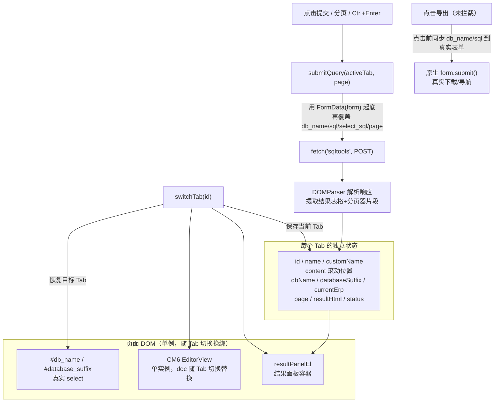

# SQL 编辑器多 Tab 独立查询重构方案

## 背景与关键事实（已通过对比 sqltools.html / sqltools_result.html 确认）

- 查询页面是**标准表单 POST**：`<form method="POST" name="QueryToolForm" action="sqltools">`，点击"提交"（`#check_submit`，无 `type`，默认 `submit`）会触发**整页导航**，服务端把结果表格 `+` 分页器直接渲染进同一个 `.content` 容器（位于 `
 支持操作: ... 
` 之后，`
` 结束前）。
- "导出"按钮是**另一个元素**（同样写了 `id="check_submit"`，属于目标页面已有的重复 id 缺陷，但因为它带 `formaction="sqltools_excel" type="submit"`，可以用 `form.querySelector('button[formaction="sqltools_excel"]')` 精确定位，不受重复 id 影响）。
- 分页控件（`#previousPage` / `#nextPage` / `#pageindex`）**已用 `sqltools_pages.html`（11 页结果样例）确认**：只有"可用的那个方向"才会渲染成带 `id` 的 `<a href="#" id="...">`，不可用的方向渲染成无 id 的纯 ``（第 1 页时"上一页"是 span、"下一页"是 `<a id="nextPage">`；只有 1 页时两个都是 span，见 `sqltools_result.html`）——正好天然适配"按 id 做事件委托"的设计，不存在的方向本来就没有 id 可以被委托捕获到。页面自带的 `$('#previousPage').click(...)` 等绑定是在**每次整页刷新时的 inline `<script>` 重新执行**才生效的——AJAX 化后我们不会重新执行注入片段里的 `<script>`，所以必须自己用**事件委托**重新实现这三个交互，不能依赖原页面脚本。"共 N 页"这段文字只做展示，不做数值解析/边界判断（`sqltools_error.html` 里出现过"共 1L页"这种带 `L` 的异常文本，很可能是后端 Python2 long 类型 repr 直接拼进字符串，进一步说明这段文字不可靠）。
- 数据库自动补全目前通过 `jquery.textcomplete` 绑定在原生 `#sql` textarea 上；油猴脚本把真实 textarea 隐藏后，键盘事件永远不会再落到它身上，这条补全能力已经**完全失效**（已确认要修复）。
- SQL 报错（如表不存在）**已用 `sqltools_error.html` 确认**：报错**复用了跟正常结果完全一样的 DOM 结构**（`div[style*="overflow:scroll"] > table.table-bordered`），只是表格内容变成固定两行——第一行单元格是 `Error`，第二行是具体错误信息（如 `(1146, "Table 'vinanalysis.btx_brand' doesn't exist")`）；`#error-tip` 在报错场景下依然是空的，跟这个功能无关。

## 已确认的关键决策（通过提问得到）

- 提交查询改为 **AJAX**（fetch 到同一个 `sqltools` 地址），解析响应 HTML 提取结果片段注入当前 Tab 的结果区，页面不再整页刷新；分页操作同样走 AJAX。
- "导出"按钮保持**真实表单提交**（导出前把当前激活 Tab 的状态同步进真实表单字段）。
- 出错场景**已用真实样例（`sqltools_error.html`）确认**：报错复用了跟正常结果一样的 `div[style*=overflow] > table.table-bordered` 结构，"精确提取"分支本来就能正确抓到，不需要走通用兜底；额外加一个"检测到 `Error` 特征形状则渲染成醒目错误提示样式"的小优化。
- Tab 名称支持**双击重命名**。
- 追加需求：修复 CM6 接管后数据库字段/表名自动补全失效的问题（改为 CM6 原生补全），其余增强（SQL 格式化、复制 CSV、Tab 快捷键切换）**不做**。

## 架构总览

## 实施要点

### 1. Tab 数据模型扩展（保留原有加载与配置逻辑不变）

在现有 `tabs` 结构基础上新增字段：`dbName`、`databaseSuffix`、`currentErp`、`page`、`resultHtml`、`status`（`idle`/`loading`/`done`/`error`）、`customName`（用户是否手动改过名）。

### 2. 去掉 Tab 数据持久化，保留启用/禁用开关

- 删除 `STORAGE_KEY_TABS` 相关：`restoreTabs()` 里"从 GM 存储恢复"的分支、`persistTabs()` 里的 `GM_setValue`、`beforeunload` 持久化监听、菜单命令"清除 Tab 数据"。
- `restoreTabs()` 简化为：始终用当前 textarea 内容 + 当前 `#db_name` 选中值 + 若页面已经带有结果（初次加载即是 `sqltools_result.html` 这种情形）解析出的结果片段，创建 Tab 1。
- 保留 `STORAGE_KEY_ENABLED` 及"启用/禁用"菜单命令（这是脚本级开关，与 Tab 内容无关）。

### 3. AJAX 提交核心：`submitQuery(tab, { page })`

- 定位真实提交按钮：`form.querySelector('#check_submit')`（重复 id 下取到的就是"提交"按钮，与原生 `getElementById` 行为一致），改为**捕获阶段拦截** `click`，`preventDefault()` + `stopPropagation()`。
- 参数构建：`new URLSearchParams(new FormData(form))` 起底当前表单所有字段（含未来可能出现的隐藏字段，如 CSRF token），再用 tab 模型覆盖 `db_name`、`database_suffix`、`sql`（CM6 doc 全文）、`select_sql`、`current_erp`、`page`（新查询重置为 1，分页操作则递增/指定）。
  - 特别说明 `page`：`#pageindex`（`name="page"`）在原始页面结构里位于 `</form>` **之外**（分页器渲染在表单下方，不在表单内），原页面靠 `document.forms["QueryToolForm"].appendChild(page)` 临时把它"借"进表单再提交（见 `sqltools.html` 498-502 行）。这意味着 `FormData(form)` 起底**本来就不会包含 `page`**，所以我们必须显式 `params.set('page', String(page))`，不是"保险起见覆盖"，而是"这个字段本来就不在表单快照里"。不需要照搬原页面"把元素搬进表单"的技巧。
- `fetch(form.action, { method: 'POST', body: params, credentials: 'same-origin' })`，保持与原生表单一致的 `application/x-www-form-urlencoded` 编码。
- 提交期间：`tab.status = 'loading'`，若为当前激活 Tab，按钮文案改为"查询中..."并禁用，结果区显示简单 loading 占位。
- 响应处理：`new DOMParser().parseFromString(text, 'text/html')`，从 `.content` 中提取表单之后的内容：
  - 优先精确提取 `div[style*="overflow"]`（结果表格容器）与 `div.pager`（分页器）——**已用 `sqltools_error.html`/`sqltools_pages.html` 确认**，正常结果、报错、多页场景全部落在这条路径，不需要靠通用兜底兜报错；
  - **报错识别优化**：提取到的表格如果形状是"仅 2 行、每行仅 1 个单元格、第一行文本正好是 `Error`"（对应 `sqltools_error.html` 的结构），识别为报错，渲染成醒目的错误提示样式（而不是当成普通数据表格展示），第二行内容作为具体错误信息展示；
  - 找不到 `div[style*="overflow"]` 时**兜底**：把 `.content` 内 `</form>` 之后到结尾的全部 HTML 原样保留（覆盖未知结构，理论上目前已知的正常/报错/多页场景都不会落到这里）；
  - 彻底解析不出 `.content`（例如被重定向到登录页）时，展示"会话可能已过期，请手动刷新页面重新登录"提示。
- **并发/竞态防护**：每个 tab 维护一个自增计数器 `requestSeq`；`submitQuery` 发起前 `tab.requestSeq++` 并记下本次请求的序号，响应回来后先比对"`tab.requestSeq` 是否还等于发起时的序号"，不等则直接丢弃（不更新 `resultHtml`、不渲染）——防止同一个 tab 连续发起两次请求时，后发先至/先发后至导致旧响应覆盖新响应。不需要用 `AbortController` 真正取消网络请求，序号比对已经足够保证正确性。
- 更新 `tab.resultHtml` / `tab.page` / `tab.status`；仅当该 tab 仍是当前激活 tab **且**序号校验通过时才重新渲染结果区。

### 4. 结果面板与分页事件委托

- 新增 `resultPanelEl`，插入位置：`form.insertAdjacentElement('afterend', resultPanelEl)`，即紧跟在 `<form name="QueryToolForm">` 后面（按 DOM 结构关系定位，不按"支持操作"这类具体文案定位，避免文案改动导致定位失效），视觉位置与原生结果渲染位置一致；初始为空/占位文案"尚未查询，输入 SQL 后点击提交"。
- `renderResultPanel(tab)`：根据 `tab.status`/`tab.resultHtml` 设置 `resultPanelEl.innerHTML`。
- 在 `resultPanelEl` 上做**一次性事件委托**（不随内容刷新重新绑定）：
  - `click` 委托 `#previousPage` / `#nextPage` → `submitQuery(activeTab, { page: activeTab.page ± 1 })`；
  - `keypress` 委托 `#pageindex`（Enter）→ 读取输入框数值 → `submitQuery(activeTab, { page: 该数值 })`。

### 5. Tab 切换时联动真实的 `#db_name` / `#database_suffix`

- `saveCurrentTabState()` 扩展：额外记录当前 `#db_name`、`#database_suffix`、`#current_erp` 的值到 tab 模型。
- `loadTabState(tab)` 扩展：把这三个字段的值写回真实 DOM，并 `dispatchEvent(new Event('change'))` 触发页面自带的 `$('#db_name').change(...)` 逻辑（负责 ERP 子库下拉的显示/隐藏），再调用 `renderResultPanel(tab)` 刷新结果区。
  - **已知次要限制（best-effort，不专门处理）**：`#database_suffix` 的选项是原页面用 `$.get('/operate/get_erp', ...)` 异步重新拉取填充的，如果我们在 `dispatchEvent(change)` 后立刻尝试把 `tab.databaseSuffix` 写回 `#database_suffix.value`，这个异步请求可能还没填充完 options，赋值会落空。这个场景仅影响"数据库选了 ERP/erp 且切换 Tab 后子库后缀没有正确恢复"，属于边缘场景（本工具大部分数据库不需要子库后缀），先不写等待/监听逻辑，后续如果实际用到再补（比如用 `MutationObserver` 监听 `#database_suffix` 的 options 变化后再赋值）。
- `addTab()` 新增 Tab 时 `dbName` 默认置空（与原页面默认 `<option value=""></option>` 一致），强制用户显式选择数据库，结果区清空为初始占位。

### 6. Tab 重命名（双击）

- 在 `renderTabBar()` 里给名称 `` 加 `dblclick` 监听：替换为一个内联 `<input>`，预填当前名称并全选；`blur`/`Enter` 提交（trim 后为空则还原旧名），`Escape` 取消；提交成功后设置 `tab.customName = true`。

### 7. 修复数据库字段自动补全（CM6 原生补全）

**根因**：`$('#sql').setAutocomplete(reserveds.concat(result.data))`（`sqltools.html` 405-440/464-491 行）把 `jquery.textcomplete` 绑定在隐藏的原生 `#sql` textarea 上，监听的 `keyup`/`input` 事件永远发生在用户实际输入的 CM6 `.cm-content` 上，事件传不过去；即便传过去，textcomplete 改写的是 textarea 的 value，也不会同步回 CM6 的 `EditorState`。这是结构性失效，必须换成 CM6 自己的补全体系，不是配置问题。

**方案**（已用实测验证调整）：`reserveds` 里的关键字全部是标准 MySQL 方言关键字，CM6 的 `sql({dialect: MySQL, upperCaseKeywords:true})` 内部本来就会通过 `@codemirror/lang-sql` 注册一份关键字补全源，覆盖 `reserveds` 现有的全部内容（已实测确认）——所以**不再手工维护关键字列表**，`reserveds` 精简为一个空数组，留作以后手动补充"CM6 词表里没有、平台特有"的伪关键字/自定义函数名的扩展口子。

关键的实现细节：`autocompletion()` 的 `override` 选项是"完全替换"语义——一旦设置 `override`，CM6 不会再去自动收集 `sql()` 通过 language data 注册的官方关键字源，如果 `override` 里只放我们自己"只查数据库 token"的源，反而会让关键字补全也一起消失。因此不能简单地把 `reserveds` 塞进自定义源了事，而是要**显式地把官方关键字源也一起放进 `override` 列表**：

- `@codemirror/lang-sql` 除了 `sql()` 便捷封装，还单独导出了 `keywordCompletionSource(dialect, upperCaseKeywords)`，专门用于这种"要自己组合多个补全源"的场景——直接复用它，不用我们重新维护关键字表，以后 CM6/lang-sql 升级关键字集也自动受益。这个函数就在现有 `loadCM6()` 已经加载的 `@codemirror/lang-sql@6` 模块里，只是多解构一个具名导出，**不需要额外发网络请求**。
- 我们自己只需要写一个更小的补全源函数 `dbTokenCompletionSource(context)`，职责收窄为"只返回当前 Tab 所选数据库对应的表/字段名"（加上 `reserveds` 里如果以后手动补充的扩展词）：
  - **触发条件**：`context.matchBefore(/\w+/)` 取光标前的连续单词字符；长度 `< 2` 且非 `context.explicit`（`Ctrl+Space` 强制触发）时返回 `null`，沿用原来"至少 2 个字符才触发"的规则（对应原 `match: /\b(\w{2,})$/`），保持体验一致。
  - **候选词分类**：不做"表名 / 字段名"的图标区分，统一给 `type: 'keyword'`，保持一份纯文本列表——`/operate/get_database_tokens` 返回的 `result.data` 本身是不带表/字段从属关系的扁平字符串数组，没有可靠依据去分类，强行分类反而可能分错。
  - **返回结构**：`{ from: word.from, options: [...], validFor: /^\w*$/ }`。
- 最终接入方式：`autocompletion({ override: [keywordCompletionSource(CM6.MySQL, true), dbTokenCompletionSource] })`，两个源都会被查询，结果自动合并展示。
- `loadCM6()` 的动态加载逻辑保持现有写法风格不变，只是新增一个模块：`@codemirror/autocomplete`（先尝试从 `codemirror` 元包取 `autocompletion`，缺失则按现有 fallback 模式回退到 `https://esm.sh/@codemirror/autocomplete@6`），并从已加载的 `@codemirror/lang-sql@6` 模块多取一个 `keywordCompletionSource` 具名导出，**不改动现有 EditorState/keymap/placeholder 的加载与兜底细节**。
- 数据库切换（`#db_name` change 或 Tab 切换）时更新"当前补全用的 token 缓存"这个模块级变量（用 `Map<dbName, tokens[]>` 缓存已拉取过的库，避免重复请求），`dbTokenCompletionSource` 读取它即可，无需为每个 Tab 单独维护编辑器实例。
- 备注：`keywordCompletionSource` 的具体导出签名以实现时实测的 `@codemirror/lang-sql` 版本为准（esm.sh 默认解析到最新版）；如果发现签名或行为与预期不符，**直接报错，不做手工维护关键字数组的兜底**，届时自行排查解决。
- **两个补全源的触发条件互相独立，不会干扰**：`override` 数组里的每个源都是独立的纯函数 `(context) => result | null`，CM6 用同一个 `context` 分别调用每一个源，谁的内部触发判断（几个字符触发、要不要 `explicit`）完全是自己的事，互不感知；只要数组里任意一个源返回非 `null`，弹框就会显示，多个源的结果会合并展示。所以 `dbTokenCompletionSource` 里"`< 2` 字符返回 `null`"的判断，只影响它自己要不要出候选词，不会延迟、屏蔽或改变 `keywordCompletionSource` 的触发时机，反之亦然。这是 `@codemirror/autocomplete` 多源组合的标准架构保证，不需要我们额外写代码去做隔离。

### 8. 其余 CM6 配置维持不变

不改动已有的 `basicSetup` / `sql({dialect: MySQL, upperCaseKeywords:true})` / `oneDark` / `lineWrapping` / 自定义 `theme` / 现有 keymap（`Ctrl+Enter` 提交、`Ctrl+S` 保存）。仅新增第 7 点的 `autocompletion` 扩展。

### 9. 导出按钮：保持真实提交，仅确保字段已同步

- 定位：`form.querySelector('button[formaction="sqltools_excel"]')`，**不拦截其 click**。
- 由于 `#sql` / `#db_name` / `#database_suffix` / `#select_sql` / `#current_erp` 在任何时刻都已经和当前激活 Tab 保持同步（第 3、5 点的副作用），导出时点击即可直接使用真实表单当前值，无需额外处理。

## 待补充信息（已全部确认，不再需要）

- ~~SQL 出错时的真实响应 HTML 样例~~ —— 已用 `sqltools_error.html` 确认，报错复用正常结果的表格结构，无需专门兜底。
- ~~多页结果的真实响应 HTML 样例~~ —— 已用 `sqltools_pages.html` 确认，分页控件的 id 出现规律与事件委托设计完全匹配。

## 验证方式

因为本地没有真实后端，计划同步更新 `test-sql-highlight.html` 本地测试页，让它的 mock `<script>` 模拟一个"提交后返回结果 HTML 片段"的行为（而不是像现在这样只是 `console.log`），这样可以在改动脚本逻辑的过程中，本地跑通"多 Tab 独立查询 + 切换 Tab 保留结果 + 分页"的完整链路，再上生产环境做最终验证。
