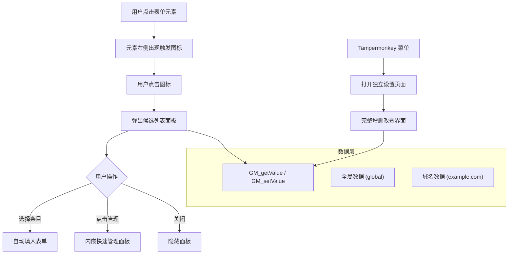

# Tampermonkey 自动填入脚本

## 目标文件

单文件脚本：`d:\Repository\front_demo\tampermonkey-autofill.user.js`

---

## 功能架构




## 数据结构设计

```javascript
// GM_getValue('autofill_data') 存储的 JSON 结构
{
  "global": [
    { "id": "uuid", "label": "姓名", "value": "张三", "createdAt": 1234567890 },
    { "id": "uuid", "label": "手机", "value": "13800000000", "createdAt": 1234567890 }
  ],
  "example.com": [
    { "id": "uuid", "label": "测试账号", "value": "test001", "createdAt": 1234567890 }
  ]
}
```

- 每条数据包含：唯一 ID、标签（分类显示用）、填入值、创建时间
- `global` 键下的数据在所有域名均可见
- 具体域名键下的数据仅在该域名出现

## 模块划分

### 1. 触发图标模块

- 监听 `focus` 事件，目标元素：`input[type=text]`、`input:not([type])`、`input[type=email]`、`input[type=search]`、`input[type=number]`、`textarea`
- 在元素右侧（或右上角）插入一个小图标按钮（📋 或自定义 SVG）
- 失焦且候选面板未激活时，图标延迟隐藏

### 2. 候选列表面板

- 点击图标后弹出悬浮 `div`，位置跟随目标元素
- 展示当前域名数据 + 全局数据，分两组显示（`[全局]` / `[当前站点]`）
- 支持面板内搜索过滤
- 每条目右侧有编辑/删除快捷按钮
- 面板底部有"快速添加"按钮（将当前输入框内容作为新条目保存）和"管理全部"按钮（打开设置页）

### 3. 数据管理设置页

- 通过 `GM_registerMenuCommand('打开自动填入管理')` 在 Tampermonkey 菜单注册
- 新开 `window.open` 空白标签页，注入完整管理 UI（纯 HTML/CSS/JS，无外部依赖）
- 功能：
  - 查看所有条目（按域名分组）
  - 新增条目（选择域名：全局 / 当前域名 / 手动输入域名）
  - 编辑标签和值
  - 删除条目
  - 导入/导出 JSON（备份与迁移）

### 4. 数据读写层

- 使用 `GM_getValue` / `GM_setValue` 持久化存储
- 所有读写封装为统一函数，保证并发安全（写前读取最新数据再合并）

## 技术方案


| 项目   | 方案                                            |
| ---- | --------------------------------------------- |
| 存储   | `GM_setValue` / `GM_getValue`（无需外部 DB）        |
| 样式隔离 | Shadow DOM 或唯一前缀 class，防止被宿主页面样式污染            |
| 外部依赖 | 无（纯原生 JS + CSS-in-JS 字符串）                     |
| 兼容性  | Chrome + Tampermonkey 4.x，`@grant` 声明所需权限     |
| 脚本头部 | `@match *://*/*` 全站匹配，`@run-at document-idle` |


## 脚本头部声明

```javascript
// ==UserScript==
// @name         AutoFill Helper
// @namespace    http://tampermonkey.net/
// @version      1.0.0
// @description  点击表单元素时提供候选内容自动填入，支持按域名管理
// @author       You
// @match        *://*/*
// @grant        GM_getValue
// @grant        GM_setValue
// @grant        GM_registerMenuCommand
// @run-at       document-idle
// ==/UserScript==
```

## 待确认的细节（可在执行前调整）

- 触发图标的视觉样式（目前计划用剪贴板 SVG 小图标）
- 数据是否支持"信息组合"（一次填多个字段），目前方案只做单字段填入 
- 设置页是否需要导入/导出功能

