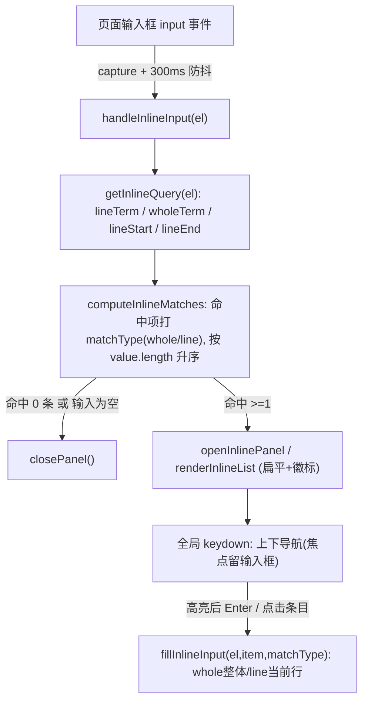

# 输入触发自动填充面板

## 目标与两种面板模式

引入面板模式 `panelMode`：
- `search`（现有，图标点击）：顶部带搜索框、焦点在搜索框、底栏（添加/管理）、填充为**全量替换**。保持不变。
- `inline`（新增，输入框输入触发）：**无搜索框、无底栏**、焦点保留在页面输入框、300ms 防抖、填充为**区间替换**。

## 取词与匹配规则（核心）

搜索词取两个候选：**当前行**（光标所在行）与**输入框整体内容**；任一长度 > 100 字符则放弃该候选。匹配用 `label`/`value` 双字段 `includes`（不区分大小写），命中并集去重。无任何命中 → 关闭面板。输入清空 → 关闭面板。

### 每项的匹配类型（matchType）

每个命中项打上**单一**匹配类型（用于徽标与填充）：
- 命中「整体内容」候选 → `whole`（徽标文案：`整体替换`）；
- 否则仅命中「当前行」候选 → `line`（徽标文案：`当前行`）。
（同时命中两者时按 `whole` 优先，保证每项类型唯一。）

### 填充替换范围规则（随该项 matchType）

- `whole` 项 → 替换整个输入框值 `[0, value.length]`；
- `line` 项 → 只替换当前行 `[lineStart, lineEnd]`，保留前后内容。
替换后光标置于插入值末尾，并派发 `input`/`change`。

### 展示与排序

inline 面板列表**不按域名/全局分组**，而是把所有命中项（含 `whole` 与 `line`）**扁平合并**，按 `value` 字符串长度**升序**排列（越短越靠前）；每项右侧/标签处展示其 matchType 徽标。

## 数据流

## 关键改动点（[tampermonkey-autofill.user.js](tampermonkey-autofill.user.js)）

- 状态区（约 785-795 行）新增：`panelMode`、`inlineCtx`（缓存 lineStart/lineEnd/lineTerm/wholeTerm）、`inputDebounceTimer`、`isFilling` 标志、常量 `MAX_QUERY_LEN = 100`。
- 取词与匹配：新增 `getInlineQuery(el)`、`itemMatchesTerm(item, term)`；新增 `computeInlineMatches(domain, terms)`：遍历该域名+全局所有项，对命中项计算 `matchType`（命中 wholeTerm→`whole`，否则命中 lineTerm→`line`），返回**去重、按 `value.length` 升序**的 `[{item, scope, matchType}]` 扁平数组。
- 渲染重构：从现有 `renderPanel`（1183 行）抽出共享条目构建（复用 `buildItemEl`）。`renderPanel` 保留 search 模式全部逻辑（分组+搜索框/底栏/自动聚焦 srchEl），行为不变；新增 `renderInlineList(inputEl, domain)`：调用 `computeInlineMatches` 得到扁平有序数组，**不分组**逐项 `buildItemEl(..., matchType)` 渲染，不建搜索框/底栏、不抢焦点。
- `buildItemEl`（1322 行）增加可选 `matchType` 参数：inline 模式下在 `.afh-item-lbl` 处追加徽标 `.afh-badge`（`whole`→`整体替换`、`line`→`当前行`），并隐藏编辑/删除按钮。点击处理按 `panelMode` 分支：`search` → `fillInput(inputEl, item.value)`；`inline` → `fillInlineInput(inputEl, item, matchType)`；随后 `closePanel()`。
- 样式：新增 `.afh-badge`（小号、圆角、浅底）样式，注入到 `styleEl`（约 748 行选中态附近）。
- 打开面板：`openPanel(el)` 内设 `panelMode='search'`（现有图标流程不变）；新增 `openInlinePanel(el)` 设 `panelMode='inline'`、建无搜索框面板、调 `renderInlineList`、`positionPanel`。
- 新增监听：`document.addEventListener('input', ..., true)`，匹配 `INPUT_SELECTOR` 且 `!isFilling` 时 300ms 防抖调 `handleInlineInput`；handle 内：取词→无候选/无命中/空值则 `closePanel`，否则 panel 不存在则 `openInlinePanel`、已存在且为 inline 则 `renderInlineList` 并重置 `panelActiveIdx=-1`。
- 扩展全局 `keydown`（1077 行）：`Escape` 关闭沿用；当 `panelMode==='inline' && panelEl` 时处理 `ArrowDown/ArrowUp`（preventDefault + `updateActiveItem`，焦点留输入框）与 `Enter`（仅 `panelActiveIdx>=0` 时 preventDefault 并 `items[idx].click()` 填充；未高亮则放行）。
- 新增 `fillInlineInput(el, item, matchType)`：依据该项 `matchType` 计算替换区间（`whole`→`[0, value.length]`，`line`→`inlineCtx` 的 `[lineStart, lineEnd]`），用原型 setter 写值、设光标、`isFilling` 包裹后派发 `input`/`change`，避免再次触发搜索。
- 图标点击（820 行）：保证始终进入 search 模式——若当前为 search 面板则关闭，否则 `closePanel()` 后 `openPanel(activeInput)`。

## 不改动

数据层 CRUD、设置页、Shadow DOM/样式、图标显示隐藏、外部点击关闭、滚动/resize 重定位均保持原样。`renderPanel` 现有调用点（搜索框 input、编辑/删除/添加/保存）行为不变。