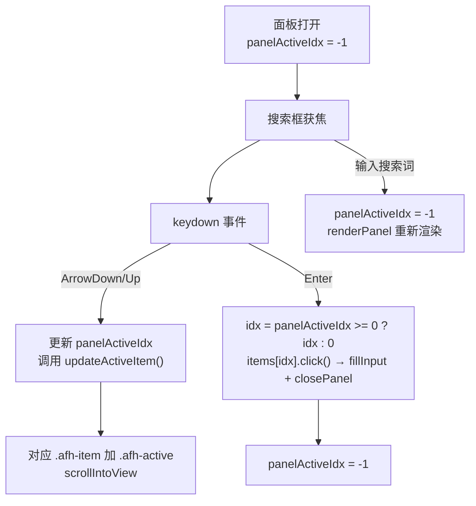

# 面板键盘导航功能

目标文件：[tampermonkey-autofill.user.js](tampermonkey-autofill.user.js)

## 功能说明

- 面板打开且存在填充条目时，按 **Enter** 自动填充第一条（无高亮时）或当前高亮条目
- 按 **↑ / ↓** 方向键在条目间循环移动高亮
- 高亮条目显示明显区别样式（浅紫背景 + 左侧紫色竖线）

## 变更点

### 1. 新增状态变量（~第 780 行之后）

```javascript
var panelActiveIdx = -1; // 当前键盘选中条目的索引，-1 表示无选中
```

### 2. 新增高亮 CSS 样式（注入到 styleEl.textContent 数组末尾，~第 741 行之前）

```css
.afh-item.afh-active {
  background: #ede9fe;
  box-shadow: inset 3px 0 0 #4f46e5;
}
```

与 hover 的 `#f5f3ff` 背景不同，`#ede9fe` 更深，配合左侧竖线使选中态视觉更突出。

### 3. 新增辅助函数 `updateActiveItem()`（在 `closePanel` 附近添加）

```javascript
function updateActiveItem(items) {
  for (var i = 0; i < items.length; i++) {
    if (i === panelActiveIdx) {
      items[i].classList.add('afh-active');
      items[i].scrollIntoView({ block: 'nearest' });
    } else {
      items[i].classList.remove('afh-active');
    }
  }
}
```

### 4. 修改 `openPanel`：在搜索框添加 keydown 监听（~第 1091 行 srchEl 的 input 事件旁）

在 `srchEl.addEventListener('input', ...)` 后紧接着添加：

```javascript
srchEl.addEventListener('keydown', function (e) {
  if (!panelEl) return;
  // 存在表单时不拦截（避免干扰添加/编辑操作）
  if (panelEl.querySelector('.afh-form')) return;
  var items = panelEl.querySelectorAll('.afh-item');
  if (items.length === 0) return;
  if (e.key === 'ArrowDown') {
    e.preventDefault();
    panelActiveIdx = (panelActiveIdx + 1) % items.length;
    updateActiveItem(items);
  } else if (e.key === 'ArrowUp') {
    e.preventDefault();
    panelActiveIdx = panelActiveIdx <= 0 ? items.length - 1 : panelActiveIdx - 1;
    updateActiveItem(items);
  } else if (e.key === 'Enter') {
    e.preventDefault();
    e.stopPropagation();
    var idx = panelActiveIdx >= 0 ? panelActiveIdx : 0;
    if (items[idx]) items[idx].click();
  }
});
```

### 5. 修改搜索框的 `input` 事件回调：搜索词变化时重置索引

```javascript
srchEl.addEventListener('input', function (e) {
  panelActiveIdx = -1;  // 新增：搜索变化时清除选中态
  renderPanel(el, domain, e.target.value, false, null);
});
```

### 6. 修改 `closePanel`：关闭时重置索引

```javascript
function closePanel() {
  if (panelEl) { panelEl.remove(); panelEl = null; }
  if (srchEl)  { srchEl = null; }
  if (iconEl)  iconEl.style.display = 'none';
  panelActiveIdx = -1;  // 新增
}
```

## 数据流


